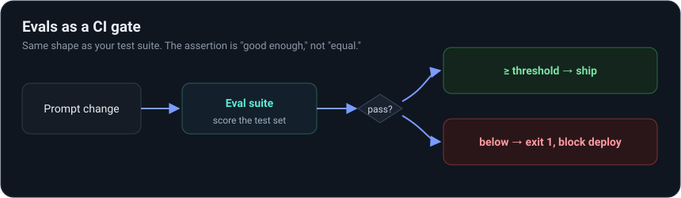

# From DevOps to agentic engineering

The weekend gets you literacy and three small agents. This is the path after it.

The idea behind the path: don't try to out-research the ML researchers. Own the operational
layer of agents instead, the part that's closest to what you already do, and the part teams
are short on. That's where your experience counts double and the roles are easiest to win.

## The roles to aim at

| Role | What it is | How much you already have |
|------|------------|----------------------------|
| LLMOps / AI platform engineer | CI/CD, deploy, monitor, eval, and cost-control for LLM apps | Most of it. It's DevOps plus a few LLM specifics |
| Agent infrastructure engineer | Build the runtime, tooling, and MCP servers agents run on | A lot. Systems work plus new protocols |
| AI / agent engineer (product) | Design and ship agent features | Some. You'd add prompt and agent design |
| ML platform / reliability | Serving, GPUs, throughput, SLOs for AI | A lot. Your infra skills carry over |

Aim at the first two. They're the least crowded and the most shaped like you.

## What to learn after the weekend

Roughly in order of payoff for your background:

1. **Evals at scale.** Datasets, scoring (LLM-as-judge, rubrics), regression suites, and
   gating deploys on them. Your CI instinct is the whole game here.

2. **Tracing for agents.** LangSmith, Langfuse, or Phoenix: a span per step, token and cost
   dashboards, latency SLOs.
3. **RAG and vector DBs.** Embeddings, chunking, retrieval quality, the data pipeline around
   it. The most common "agent" in industry is really RAG.
4. **Agent security.** Prompt injection, tool sandboxing, least-privilege tool access,
   secrets, output filtering. This maps straight onto your IAM and security work.
5. **MCP servers.** Build and operate tool servers. A clean specialty to own.
6. **Frameworks.** LangGraph and the Claude Agent SDK in depth, enough OpenAI SDK to read it.
7. **Cost and performance.** Caching, model routing, batching, smaller models where they do.
8. **Deployment patterns.** Streaming endpoints, queues for long runs, rolling back prompts
   and models the way you roll back a release.

## Projects to build, in order

Make each one public, with a README, evals, tracing, and a Dockerfile. The operational layer
is the part that proves you, so show it.

1. The capstone from this weekend: a small agent with a trace, an eval, and a Dockerfile.
2. A RAG agent over real docs (your team's runbooks work well), with a retrieval eval suite.
3. An MCP server that exposes a real tool, say a cloud API, plus an agent that uses it.
4. A small agent platform: an agent deployed with CI-gated evals, a trace dashboard, cost
   alerts, and rollback. This one is close to the actual job, so it's the centerpiece.

## A rough cadence

About 8 to 12 weeks at 6 to 8 hours a week:

- Weeks 1–2: firm up the basics and prompt/agent design (Anthropic docs and Cookbook).
- Weeks 3–4: evals. Build project 2's eval suite and learn LLM-as-judge.
- Weeks 5–6: RAG and vector DBs. Finish project 2.
- Weeks 7–8: MCP. Build project 3.
- Weeks 9–12: the platform project, plus security hardening, and write each project up.

## What to say in interviews

The line that lands, once you can show it: "I treat prompts and models as artifacts.
Versioned, eval-gated in CI, traced in prod, with cost alerts and rollback." Then point at
the platform project that does exactly that. Talk in failure modes and SLOs, not demos.
That's the senior signal, and it's already how you think.
