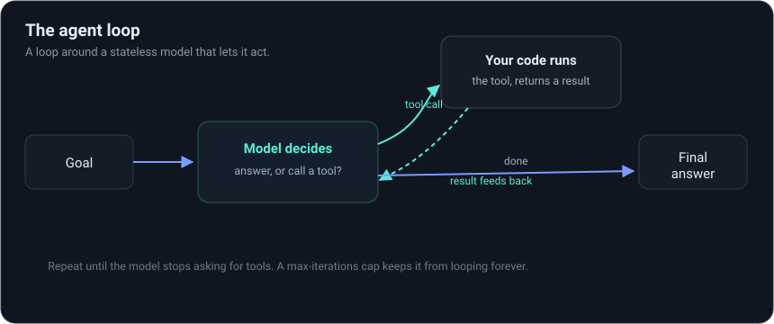
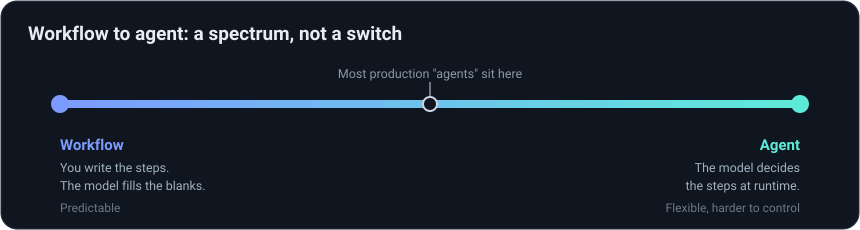

# Agentic engineering, in a weekend

You operate systems for a living. This weekend you add one new piece to that skill set: an
LLM that can use tools and act on its own. The model part is small. The part that makes
agents actually work in production is deploys, monitoring, evals, rollbacks, and cost
control, and you already do all of that for normal services.

By the end of the weekend you'll have built three working agents and wrapped one in the
operational layer that separates a demo from something you'd run on call. That's not a
career on its own. It's the first real step, and [CAREER.md](CAREER.md) maps out the rest.

## Start here

1. Read this page. Five minutes.
2. Do the [setup](SETUP.md). Another five.
3. Work the lessons in order. Each one is a file you run; the code is the lesson.

There's also a single rich page version of everything in this repo. Double-click
`index.html` (or open it in a browser) for a sidebar, search, syntax-highlighted lessons, a
dark/light toggle, and a progress tracker that remembers where you left off. Rebuild it after
any edit with `python build_site.py`.

## The one idea everything is built on

An LLM on its own is a stateless function. Text goes in, text comes out. No memory, no
internet, no ability to run code. On its own, it's a very good autocomplete.

An agent is a loop around that function that lets it act:

That's the whole field. Everything else is a variation on four questions: what tools does it
have, how does the loop run, how much does it get to decide, and how do you keep it from
going off the rails.

Two words you'll see constantly, from Anthropic's [Building Effective
Agents](https://www.anthropic.com/research/building-effective-agents):

- A **workflow** is when you write the steps and the model fills in the blanks. Predictable.
- An **agent** is when the model decides the steps at runtime. Flexible, harder to control.

Most things people call "agents" are mostly workflows with a couple of agentic steps. Where a
system sits on that line is where its reliability lives.

## The schedule

| When | Files | What you can do after |
|------|-------|------------------------|
| Day 1 | `day1/01–03` | Explain LLMs, tools, and the loop; build an agent by hand |
| Day 2, morning | `day2/04–06` | Use ReAct, reflection, and a real framework (the Claude Agent SDK) |
| Day 2, afternoon | `day2_ops/07–09` + Dockerfile | Trace it, gate it with evals, guard it, and containerize it |
| Capstone | `capstone/` | Ship one small agent with a trace, an eval, and a Dockerfile |

Other docs: the [glossary](glossary.md) maps LLM terms to ones you already use, [resources](resources.md)
is the short reading list, and [CAREER.md](CAREER.md) is the path after the weekend. If
you're teaching this to someone, [WALKTHROUGH.md](WALKTHROUGH.md) is the facilitator guide.

## Why this is a short jump for you

The hard problems in production agents are problems you've already solved once.

| What teams struggle to find | What you already do |
|------------------------------|---------------------|
| Agents you can see into in prod | Tracing, structured logs, APM |
| Catching regressions in a system that isn't deterministic | CI gates and test suites, which become **evals** |
| Cost and latency under control | Budgets, rate limits, capacity planning |
| Safe tool access and secrets | IAM, least privilege, sandboxing |
| Rolling back a bad prompt or model | Versioning, blue/green, canaries |

You're not starting over. You're learning one new primitive and pointing skills you already
have at it.
